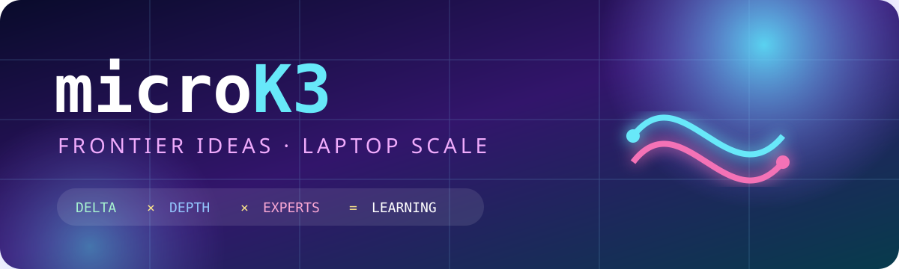

<div align="center">
  
  <p><strong>A tiny, readable model for learning four ideas behind Kimi K3.</strong></p>
  <p>
    <a href="#five-minute-tour">Five-minute tour</a> ·
    <a href="#what-is-faithful">Honesty map</a> ·
    <a href="#report-to-code-map">Report → code</a> ·
    <a href="#modal">Modal</a> ·
    <a href="docs/report-notes.md">Source notes</a>
  </p>
  <p>
    <a href="https://github.com/aryehcarmi/microk3/actions/workflows/ci.yml">
      
    </a>
  </p>
</div>

> [!IMPORTANT]
> **microK3 is K3-inspired, not Kimi K3.** It is a ~1.65M-parameter teaching model, not a
> reproduction or distillation. It never downloads the 2.8T-parameter weights. The goal is the
> Karpathy-style feeling of seeing the whole learning system—not benchmark parity.

## Why this exists

Kimi K3 combines four ideas: recurrent **Kimi Delta Attention**, periodic global
attention, **Attention Residuals** across depth, and a **Stable LatentMoE** across width. The
official implementation needs industrial infrastructure. This repository turns the conceptual
spine into one hackable file, one diagram, and a small regression suite.


## Five-minute tour

```bash
git clone https://github.com/aryehcarmi/microk3
cd microk3
python -m venv .venv
source .venv/bin/activate
pip install -e '.[dev]'
pytest -q
microk3 --steps 20
```

The test run should report `31 passed`. The first training loss should be near the uniform
byte-token baseline `ln(256) ≈ 5.55`; an initial loss in the tens or hundreds is a bug, not a
learning challenge. Twenty steps is enough to watch that number fall and nothing more—the sample
printed at the end is still byte noise, and stays noise until a few hundred steps on a real corpus.

On an Apple M2 laptop with torch 2.10, that quickstart takes about 9 seconds on CPU: roughly 2.5
training steps per second, plus a 120-byte sample. `--device mps` trains a shade faster and samples
about three times slower, because the KDA token loop launches many small kernels and pays a
one-time shader compilation on its first run. At this scale either device is fine.

Bring a text, code, or arbitrary byte corpus:

```bash
microk3 --data path/to/tiny.txt --steps 1000
```

The file must contain at least `block_size + 1` bytes—129 bytes at the default setting, though a
larger corpus is much more useful. Use `--block-size 64` for a faster CPU experiment. Training
prints a sample at the end; it intentionally does not create a checkpoint or background job.
Use `--generate 0` for a train-only run. Training defaults to the per-head Muon step with a warmup
then cosine schedule; `--optimizer adamw` switches back. Run `microk3 --help` to see the batch
size, learning rate, optimizer, prompt, temperature, and device controls.

Read [`microk3.py`](microk3.py) top to bottom. The suggested path is:

1. `KimiDeltaAttention`: Eq. 1 as a legible recurrent token loop, including channel-wise decay
   before the delta correction; Eq. 5 supplies the bounded log-decay.
2. `GatedAttention`: periodic causal global attention. K3 uses compressed MLA; microK3 uses
   ordinary attention so the lesson fits on one screen.
3. `SiTUGLU` → `StableLatentMoE`: route through a small latent, normalize the routed aggregate,
   and update dispatch biases with an exact batch-local version of Quantile Balancing.
4. `MicroK3._mix_depth`: full AttnRes-style retrieval over the embedding and individual layer
   contributions, with a separate final-output query.
5. `LayerCache` → `MicroK3.generate`: prefill once, then decode step by step. Every KDA state
   stays the same size forever; only the global layers' caches grow with the sequence.
6. `orthogonalize` → `Muon` → `build_optimizers`: K3's per-head orthogonalized step for matrix
   weights, with an undecayed AdamW tail for embeddings, gains, and biases.

Model shape—`layers`, `dim`, `experts`, `top_k`, `dense_layers`—is deliberately not exposed as CLI
flags. Edit the `Config` defaults at the top of `microk3.py` so every change stays visible in the
file you are reading.

## What is faithful?

| Idea | Kimi K3 | microK3 | Status |
|---|---|---|---|
| Hybrid schedule | 69 KDA + 24 Gated MLA; 3:1 blocks plus final global layer | 3 KDA + 1 global by default; arbitrary depths still end globally | 🟢 pattern |
| Delta recurrence | Channel-wise decay, then delta correction | Same recurrence in a readable token loop | 🟢 equation |
| KDA projections | ShortConv + Swish Q/K/V; low-rank decay logits | Plain linear Q/K/V; full-rank decay logits | 🟡 simplified |
| Lower-bounded decay | `g = -5 sigmoid(exp(A) z)` per key channel | Same mapping, per key channel | 🟢 equation |
| KDA execution | Fused chunkwise kernel | Sequential Python loop | 🟡 equivalent recurrence, slow execution |
| Global attention | Gated MLA, NoPE | Gated MHA, no positional embeddings | 🟡 substituted |
| Attention Residuals | Eight block-level groups with partial sums | Full attention over every layer contribution | 🟡 small-scale form |
| Stable LatentMoE | 896 routed, top-16, 2 shared, latent width 3,584 | 8 routed, top-2, 1 shared, latent width 64 | 🟡 scaled down |
| First dense layer | `first_k_dense_replace=1`, then 92 MoE layers | `dense_layers=1`, then MoE blocks | 🟢 pattern |
| Quantile Balancing | Global histogram estimate, applied next batch | Exact local-batch quantile, applied next forward | 🟡 scaled down |
| SiTU-GLU | β₁=4, β₂=25 | β₁=4, β₂=25 | 🟢 equation |
| Optimizer | Per-Head Muon with QK-clip; 1% warmup, cosine decay, weight decay 0.1 | Per-head Muon on matrices, AdamW tail, same schedule shape; no QK-clip | 🟡 scaled down |
| Decoding | Fused kernels; constant KDA state, compressed MLA cache | Same state-versus-cache split in a plain prefill + step loop | 🟢 pattern |
| Context and tokens | 1,048,576 learned-token context | 128 raw bytes by default | 🟡 teaching scale |
| Embeddings | Untied input and output embeddings | One tied byte embedding and head | 🟡 scaled down |
| Vision | 401M-parameter MoonViT-V2 | Absent | ⚪ out of scope |
| Native quantization | MXFP4 expert weights / MXFP8 activations with QAT | Standard PyTorch precision | ⚪ out of scope |

The KDA path deliberately omits ShortConv, Swish projections, low-rank decay projection, and the
chunkwise fused algorithm. The global layer is not MLA. Quantile Balancing is exact only over the
local teaching batch, not a distributed global histogram. These boundaries are explicit; tests
cover the recurrence’s numerical behavior, causality, cached-decoding equivalence, routing counts,
next-step bias update, optimizer parameter grouping, initialization scale, valid configuration,
generation guardrails, and corpus-window boundaries.

One subtle experiment: with `top_k=1`, the normalized selected router weight is exactly one, so the
router receives essentially no gradient through mixture weights. K3 uses top-16. Treat top-1 here
as a demonstration of that failure mode, not as a recommended setting.

## Report-to-code map

| Report section | Read this code | Preserved | Deliberately omitted or reduced |
|---|---|---|---|
| §2.1.1, Eqs. 1 & 5 | `KimiDeltaAttention` | Decay-before-correction recurrence, channel-wise retention, learned per-head scale | ShortConv, Swish, low-rank decay projection, chunkwise kernel |
| §2.1.1, Eq. 6 | `KimiDeltaAttention.forward` | Head RMSNorm and full-rank sigmoid output gate | Fused training kernel |
| §2.2, Eqs. 8–10 | `MicroK3._mix_depth` and `Block.forward` | Learned pseudo-query, normalized keys, softmax over prior contributions | Block grouping and intra-block partial sums |
| §2.3, Eqs. 11–12 | `StableLatentMoE` and `SiTUGLU` | Latent routed path, pre-up RMSNorm, bounded GLU, shared path | Report-scale widths and second shared expert |
| §2.3.3, Eqs. 13–14 | `StableLatentMoE._update_router_bias` | Bias only affects dispatch; quantile bias is used on the next pass | Distributed histogram approximation |
| §2.5 and §3.3 | `orthogonalize`, `Muon`, `build_optimizers` | Per-head Newton–Schulz step, matrix/tail split, 1% warmup + cosine shape | QK-clip, distributed sharding, report-scale tuning |

Default tensor shapes make the scale reduction concrete:

```text
tokens                         [batch, time]
hidden                         [batch, time, 128]
one KDA recurrent state        [batch, 4 heads, 32 key channels, 32 value channels]
MoE router scores              [batch, time, 8 experts]
selected experts               [batch, time, 2]
depth sources                  embedding + one contribution per completed layer
```

## Model archaeology without a 1.5 TB accident

Moonshot AI announced K3 on July 16, 2026; the public repository and technical report followed on
July 27. The metadata helper lists remote filenames and performs HEAD requests for weight sizes;
it has no file-download call and writes nothing:

```bash
pip install -e '.[inspect]'
python scripts/inspect_k3_metadata.py
```

On the 2026-07-28 UTC snapshot, it observed 118 files, including 96 weight shards totaling 1.420
TiB. Remote repositories can change, so the script prints the current values rather than treating
that snapshot as permanent. See [`docs/report-notes.md`](docs/report-notes.md) for primary links,
equation-level notes, and the exact simplifications.

## Modal

Use credits deliberately. The cloud entrypoint has a 30-minute hard timeout, caps the step count,
uses one GPU, and creates no persistent model-weight volume.

```bash
pip install -e '.[modal]'
modal setup
modal run modal_train.py --steps 500
```

It defaults to an L40S and the bundled corpus. `--batch-size`, `--block-size`, and `--optimizer`
pass through, and `--data path/to/tiny.txt` ships a corpus of up to 8 MiB with the run; anything
larger belongs in a Modal Volume. Start at 100–500 steps, inspect Modal's live cost dashboard,
then scale consciously. **A free-credit balance is not a spending guarantee**; pricing and
availability change, so check Modal before launching. The K3 weights are never fetched.

## Experiments worth trying

- Plot `block.ffn.last_load` and `block.ffn.router_bias` for an MoE block; which experts
  specialize, and how quickly does the local Quantile Balancing update respond?
- Disable `_update_router_bias` for one run and compare expert loads.
- Change `top_k` from 2 → 1 and confirm why the normalized router-weight gradient disappears.
- Replace the bounded decay with an unbounded softplus decay and inspect long-prefix retention.
- Add the omitted ShortConv + Swish projections, then compare the tensor trace.
- Train the same seed with `--optimizer adamw` and compare loss curves. At a matched learning rate
  the two finish close together on this corpus; what Muon actually buys here is insensitivity to
  that learning rate, so sweep `--muon-lr` from 0.005 to 0.05 and watch how little moves.
- Raise and lower `--learning-rate` in `--optimizer muon` runs. It touches only the embedding and
  gain tail, yet it moves the loss more than `--muon-lr` does: the tied byte head is the bottleneck.
- Generate far past `--block-size` and watch the global caches grow while every KDA state stays
  the same size.
- Compress the global layers' plain KV cache into a small latent, as MLA does, and measure memory.

## Development

```bash
ruff check .
ruff format --check .
pytest
python -m build
```

CI runs those checks on Python 3.10 and 3.13, builds the wheel and source distribution, installs
the wheel outside the checkout, imports `microk3`, and exercises the installed CLI.

## Scope, sources, and license

Architecture facts come from Moonshot AI's [official repository](https://github.com/MoonshotAI/Kimi-K3)
and [technical report](https://github.com/MoonshotAI/Kimi-K3/blob/main/k3_tech_report.pdf).
This repository contains original educational code under MIT. Kimi K3 weights have their own
[model license](https://huggingface.co/moonshotai/Kimi-K3/blob/main/LICENSE); this project neither
redistributes nor relicenses them. Contributions that make an idea clearer are especially welcome.
