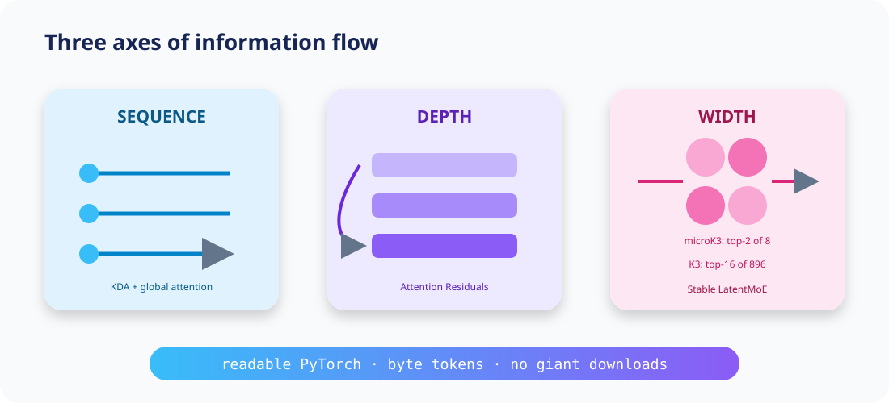

<div align="center">
  
  <p><strong>A tiny, readable model for learning four ideas behind Kimi K3.</strong></p>
  <p>
    <a href="#five-minute-tour">Five-minute tour</a> ·
    <a href="#what-is-faithful">Honesty map</a> ·
    <a href="#modal">Modal</a> ·
    <a href="docs/report-notes.md">Report notes</a>
  </p>
</div>

> [!IMPORTANT]
> **microK3 is K3-inspired, not Kimi K3.** It is a ~2M parameter teaching model, not a
> reproduction or distillation. It never downloads the 2.8T-parameter weights. The goal is
> the Karpathy-style feeling of seeing the whole learning system—not benchmark parity.

## Why this exists

Kimi K3 combines several beautiful ideas: recurrent **Kimi Delta Attention**, periodic global
attention, **Attention Residuals** across depth, and a **Stable LatentMoE** across width. The
official implementation needs industrial infrastructure. This repo turns the conceptual spine
into one hackable file, one diagram, and three tests.



## Five-minute tour

```bash
git clone https://github.com/aryehcarmi/microk3 && cd microk3
python -m venv .venv && source .venv/bin/activate
pip install -e '.[dev]'
python microk3.py --steps 100
```

Bring any text or code corpus (it is read as raw bytes, so there is no tokenizer setup):

```bash
python microk3.py --data path/to/tiny.txt --steps 1000
```

Read [`microk3.py`](microk3.py) top to bottom. The suggested path is:

1. `KimiDeltaAttention`: a legible recurrent delta update; bounded decay prevents forgetting
   factors from becoming arbitrarily small.
2. `GatedAttention`: periodic causal global attention. K3 uses compressed MLA; we deliberately
   use ordinary attention so the lesson fits on one screen.
3. `SiTUGLU` → `StableLatentMoE`: project into a small latent, route to top-k specialists, normalize,
   then project back. The bounded activation is directly from the report.
4. `MicroK3.forward`: each layer softly retrieves earlier depth states, a compact teaching version
   of AttnRes.

## What is faithful?

| Idea | Kimi K3 | microK3 | Status |
|---|---:|---:|---|
| Hybrid schedule | 69 KDA + 24 Gated MLA | 3 KDA : 1 global attention | 🟢 pattern |
| Lower-bounded decay | `g_min = -5` | `exp(-5 sigmoid(.))` | 🟢 equation |
| SiTU-GLU | β₁=4, β₂=25 | β₁=4, β₂=25 | 🟢 equation |
| Latent MoE | 896 experts, top-16, 2 shared | 8, top-2, 1 shared | 🟡 scaled down |
| Attention Residuals | 8 depth blocks | all earlier layer outputs | 🟡 simplified |
| Global attention | Gated MLA, NoPE | gated MHA, NoPE | 🟡 substituted |
| KDA kernel | chunkwise fused algorithm | equivalent-style token loop | 🟡 pedagogical |
| Vision / million context / QAT | native, production scale | absent | ⚪ out of scope |

The delta-rule code is an educational recurrence, not numerical equivalence to the fused K3 kernel.
The router implements bias-aware dispatch, but does not update biases with report-scale histogram
Quantile Balancing. These boundaries are intentional and tested—not hidden in marketing language.

## Model archaeology without a 1.5 TB accident

The report and repository appeared on **July 27, 2026**. We inspected the official 2.5 MB report and
repository metadata. Hugging Face was inaccessible from the build environment, so we make **no
weight-tensor-derived claims**. [`scripts/inspect_k3_metadata.py`](scripts/inspect_k3_metadata.py)
lists remote filenames and HEAD metadata, refuses large downloads, and writes nothing by default:

```bash
pip install huggingface_hub
python scripts/inspect_k3_metadata.py
```

Do not use `snapshot_download` for this model on a laptop. See the exact observations and primary
links in [`docs/report-notes.md`](docs/report-notes.md).

## Modal

Use credits deliberately. The cloud entrypoint has a 30-minute hard timeout, caps the step count,
uses one GPU, and creates no persistent model-weight volume.

```bash
pip install modal
modal setup
modal run modal_train.py --steps 500
```

It defaults to an L40S and the bundled corpus. Start at 100–500 steps, inspect Modal's live cost
dashboard, then scale consciously. **A free-credit balance is not a spending guarantee**; pricing
and availability change, so check Modal before launching. The K3 weights are never fetched.

## Experiments worth trying

- Plot `block.moe.last_load`; which experts specialize on punctuation or code?
- Change `top_k` from 2 → 1. Does training destabilize?
- Replace the bounded decay with a softplus decay and inspect long-prefix retention.
- Implement the report's next-batch Quantile Balancing update.
- Replace `GatedAttention` with a true latent KV cache and measure memory.

## Scope, sources, and license

The architecture facts are drawn from Moonshot AI's [official repository](https://github.com/MoonshotAI/Kimi-K3)
and [technical report](https://github.com/MoonshotAI/Kimi-K3/blob/main/k3_tech_report.pdf).
This repository contains original educational code under MIT. Kimi K3 weights have their own
[model license](https://huggingface.co/moonshotai/Kimi-K3/blob/main/LICENSE); this project neither
redistributes nor relicenses them. Contributions that make an idea clearer are especially welcome.
